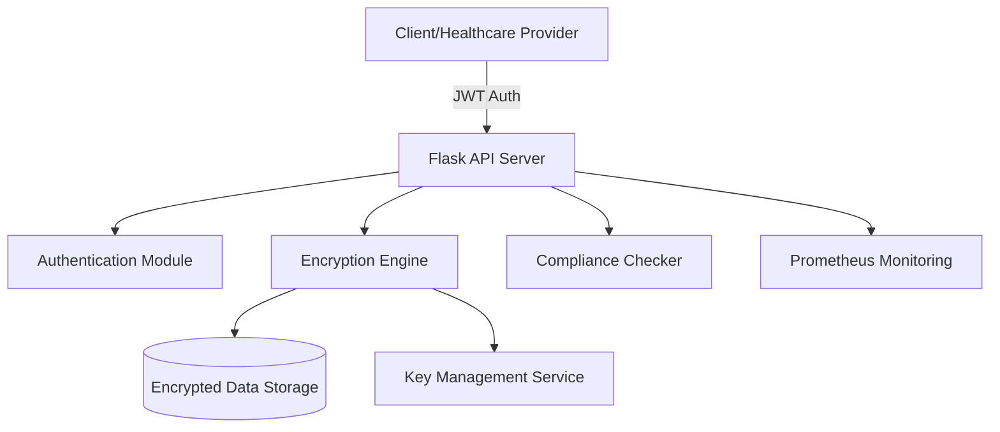

# SecureHealth: End-to-End Encrypted Healthcare Data Storage


SecureHealth is a production-ready demonstration of a secure, compliant healthcare data storage system. It implements robust encryption at rest and in transit, featuring a complete CI/CD pipeline and monitoring stack.

## ✨ Key Features

- 🔐 **End-to-End Encryption:** Uses AES-256 (Fernet) for data-at-rest encryption.
- 🔑 **Automated Key Rotation:** Integrated scripts for secure key management and periodic rotation.
- 🛡️ **JWT Authentication:** Secure API access using JSON Web Tokens with automated token decoding and verification.
- ⚖️ **Compliance Engine:** Integrated checks for HIPAA/GDPR data handling patterns.
- 🐳 **Containerized Deployment:** Fully Dockerized with `docker-compose` for easy orchestration.
- 📈 **Built-in Monitoring:** Prometheus integration for real-time system health tracking.
- 🏗️ **CI/CD Integrated:** Automated pipeline via Jenkins for testing and deployment.

## 🛠️ Tech Stack

- **Backend:** Python, Flask
- **Security:** PyJWT, Cryptography (Fernet)
- **DevOps:** Docker, Jenkins, Shell Scripting
- **Monitoring:** Prometheus
- **Database:** JSON-based encrypted storage (extendable to PostgreSQL)

## 📐 Architecture



## 🚀 Getting Started

### Prerequisites
- Python 3.9+
- Docker & Docker Compose

### Installation

1. **Clone the repository:**
   ```bash
   git clone https://github.com/SayanthSatheeesh/secure-health.git
   cd secure-health
   ```

2. **Setup environment:**
   ```bash
   python -m venv venv
   source venv/bin/activate  # On Windows: venv\Scripts\activate
   pip install -r app/requirements.txt
   ```

3. **Generate initial keys:**
   ```bash
   python keygen.py
   ```

4. **Run via Docker Compose:**
   ```bash
   docker-compose up --build
   ```

## 🔌 API Documentation

| Endpoint | Method | Description |
| :--- | :--- | :--- |
| `/auth/login` | POST | Authenticate and receive a JWT token |
| `/data/store` | POST | Encrypt and store healthcare records |
| `/data/retrieve` | GET | Decrypt and retrieve records (requires Auth) |
| `/metrics` | GET | Prometheus monitoring metrics |

## 🤝 Contributing

Contributions are welcome! Please feel free to submit a Pull Request.

## 📄 License

This project is licensed under the MIT License - see the LICENSE file for details.
